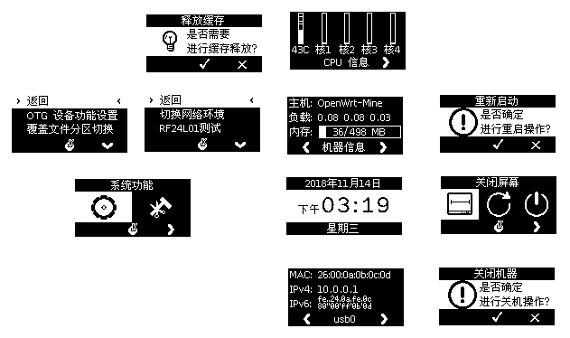

# LBPanel 及 LBKit 简介

原来，我仅仅想让 NanoPi NEO 铝盒套装（附带 OLED 扩展附件）能有一些实际用途。想法虽然简单，然而当时察觉无法满足自己的需求，便开始写些东西，不觉意间，东西愈写愈多，逐渐成为自成系统的一套工具。于是，将其梳理过后，分成两部分，LBKit 为底层开发库，LBPanel 为其上系统实用程序，其它相关软件裁剪或修改等仅仅是这两者的附带产物。

# LBPanel 功能

就目前而言，LBPanel 尚处于开发阶段，仅具备一些简单的系统实用功能。

LBPanel 初始界面通过左右键（K1/K3）双击跳转左右页视图，按页视图功能大抵如下：

* 主页：日期时间显示；主机信息显示；CPU 温度及核心负荷信息显示；网卡接口信息显示；
* 左页：OTG 设备功能设置；[覆盖文件分区切换](./howto/LBPanel/OverlaySwitch.md)；自定命令菜单；
* 右页：关闭屏幕；重启系统；关闭设备等。

即使不关心开发方面，搭配 OpenWrt，这套工具依然具有较强可玩性。OpenWrt 本来应用范围大多是无线路由方面，而将开发板接上 USB 无线网卡，加上 USB OTG 虚拟网卡接口及开发板自身网卡接口，尽可享 OpenWrt 带来的便捷。OpenWrt 同时是 Linux 核心，和其它同源系统无本质区别，开发板上引出的各种接口应用与诸如 Debian/Ubuntu Linux 等基本无异。

结合 LBPanel，甚至可以实现一些有趣的东西（以下这些部分未曾实现，仅为构想），比如：

* 设定好 OTG 存储设备的对应设备，将 NEO 变成一个 TF 读卡器。
* 编写简易 MPD 客户端，加入自定命令菜单，结合 MPD 轻易实现音乐播放器（开发板自带 AudioCodec 和 I2S）。
* 编写简易网络连接监控程序，加入自定命令菜单，轻易实现网线连接检测器。
* 更多乐趣不一而足，创意在人，期待你去发掘。

# LBKit 运行库及扩展性

LBKit 借助 Lite BeAPI，可在 Linux 系统下，以基本与 BeOS API (C++) 相同的方式编写交互应用程序。开发调试时，甚至可以结合虚拟面板实现（VPD），直接在 HaikuOS 系统（开源 BeOS 复现）上，无需任何其它运行库直接运行 LBPanel。

LBKit 可以视为 BeOS API 中 InterfaceKit（类似其它开发库中的 GUI 部分） 的另类实现（更适合低端设备），结合裁剪版的 ETK++（Lite BeAPI 本源），基本具备 KernelKit、SupportKit、NetKit、StorageKit、AppKit、InterfaceKit（以 LBKit 替代）的嵌入式 C++ 综合开发环境。

LBKit 另扩展出 lbk-menu、lbk-message 等实用命令行交互工具，可于 shell 脚本中调用，方便实现简便开发。通过 LBKit 交互设备（面板）扩展接口，亦可自行扩充显示和输入设备，甚至可以基于网络C/S模式实现。

LBKit 显示相关接口，目前仅考虑单色低分辨率屏幕（目前适用平台设备），彩色低分辨屏幕仅预留实现框架。高分辨率彩色整体屏幕可直接使用 InterfaceKit，在 LBKit 中不予考虑。

 
