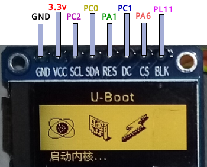

# 彩色面板

项目所提供 OpenWrt 固件，自 0.1.5 版起，将支持彩色面板设备。

现项目适用设备平台，NanoPi NEO/NEO2 及 OLED 扩展附件，并无彩色面板，彩色面板需要另行扩展。另外，对于小型屏幕，U-Boot 阶段显示彩色图案无甚意义；项目对彩色屏幕的处理，在 U-Boot 阶段，其与单色屏幕基本无甚区别。

目前市场上支持彩色显示的小型屏幕种类繁多，项目仅对个别型号提供支持如下：

## ST7735S

采用 ST7735S 控制芯片的彩色屏亦种类繁多，其使用非标准的 SPI 协议进行控制，色彩深度为 16 位（RGB565格式）。下图为其中一款 80x160 分辨率的 TFT LCD 屏与 NanoPi NEO/NEO2 开发板的接线示意图。

因此类型彩色屏种类繁多，所以设备初始化亦各有不同。项目对设备初始化在 U-Boot 中进行，所以需要在 U-Boot 环境参数中设置对应设备的相关参数。以上图设备为例，各参数如下（现所提供 U-Boot 中默认值）。

* st7735s_width = 80

屏幕宽度方向的像素点数

* st7735s_height = 160

屏幕高度方向的像素点数

* st7735s_offset_x = 26

厂家提供的宽度方向偏移量

* st7735s_offset_y = 1

厂家提供的高度方向偏移量

* st7735s_swap_xy = 1

是否变换宽度/高度方向表达。未变换时，X 方向为宽度方向，Y 方向为高度方向

* st7735s_blk_act = 1

背光打开时所对应引脚电平（1 为高电平，0 为低电平，-1 为不使用该引脚）

* st7735s_init_cmds

厂家提供的初始化指令，以 ":" 符号分割各指令+数据集合，以 "," 符号分割指令与数据。上图设备初始化指令如下：

	0x21:
	0xb1,0x05,0x3a,0x3a:
	0xb2,0x05,0x3a,0x3a:
	0xb3,0x05,0x3a,0x3a,0x05,0x3a,0x3a:
	0xb4,0x03:
	0xc0,0x62,0x02,0x04:
	0xc1,0xc0:
	0xc2,0x0d,0x00:
	0xc3,0x8d,0x6a:
	0xc4,0x8d,0xee:
	0xc5,0x0e:
	0xe0,0x10,0x0e,0x02,0x03,0x0e,0x07,0x02,0x07,0x0a,0x12,0x27,0x37,0x00,0x0d,0x0e,0x10:
	0xe1,0x10,0x0e,0x03,0x03,0x0f,0x06,0x02,0x08,0x0a,0x13,0x26,0x36,0x00,0x0d,0x0e,0x10:
	0x3a,0x05:
	0x36,0xc8

 

U-Boot 检测到设备时，将置以下各环境参数，以便下一步在 bootcmd 可依其进行设备树调整。

* st7735s

当此参数为 1 时，即通过三线 SPI 协议检测到带该控制器的彩色屏。

* lcd_buf

屏幕内容缓冲区内存起始地址（16 进制）

* lcd_buflen

屏幕内容缓冲区字节数（16 进制）

* lcd_stage2_cmd

在屏幕上绘制 “提取内核” 提示的指令集，可通过 run 执行

* lcd_stage3_cmd

在屏幕上绘制 “启动内核” 提示的指令集，可通过 run 执行

