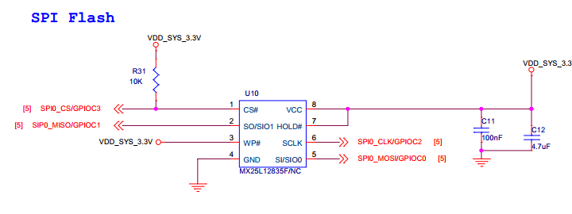
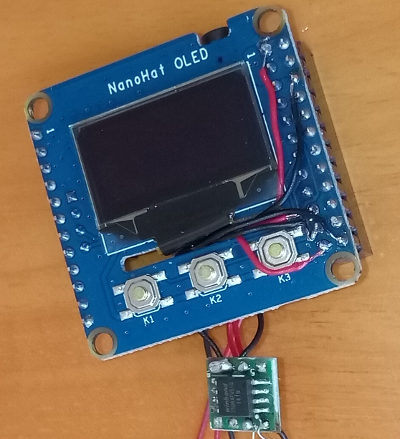

# 加设 SPI Nor Flash 及烧写固件

NanoPi NEO/NEO2 本身不带 SPI Nor Flash，需要自行添加，现项目要求其容量不小于 8MB。大于 8 MB 或需要特殊配置时，可在固件包里 images/apart 目录下找到设备树源码和其它文件，自行修改后运行 pack-all.sh 重新打包固件。

## 加设 SPI Nor Flash

作为启动介质的 SPI Nor Flash，需要连接到开发板的 SPI0，相关引脚是 PC0、PC1、PC2、PC3，可参考官方以下原理图进行接线。

接好线后样貌大抵如下图所示，再将其用耐高温胶纸或其它绝缘且可靠的方法包裹后，放置在 OLED 扩展附件下即可。

## 烧写固件

烧写固件前需要清空整片 SPI Nor Flash，再用刷写工具把固件包里 images/openwrt-xxx-oled-spi.bin 刷写到 SPI Nor Flash 的起始位置处（偏移为 0）。

* 如果已烧写过之前任意版本的固件，将上述 bin 文件通过 sftp 或其它方式上传至开发板（以下假设文件路径为 /tmp/openwrt.bin），则可在 shell 下运行以下指令直接烧写并重启。

	切记: 若 overlay 分区是 SPI Nor Flash 上原始分区，reboot 指令前不要进行任何其它操作！！！

        mtd erase /dev/mtd0
        dd if=/tmp/openwrt.bin of=/dev/mtd0
        reboot

* 如果开发板此前曾刷写过项目提供的 U-Boot，可以先接上 USB 键盘，在启动时按住 K2 键，并在屏幕出现 U-Boot 的调试信息时，按键盘上 CTRL+C 键组合中断启动，然后输入以下指令清空 SPI Nor Flash（以下均以 8MB 容量为例）。

        sf probe 0
        sf erase 0 0x800000

* 如果想在 U-Boot 下直接刷写固件，可将上述 bin 文件复制（以下假设文件名为 openwrt.bin）到 TF 卡第一个分区（以下以 fat 格式为例），插入 TF 卡后输入以下指令直接刷写。

        注意：此前项目前期提供的 U-Boot 刷写会出现问题，不建议使用。

        mmc dev 0
        fatload mmc 0 0x48000000 openwrt.bin
        sf write 0x48000000 0 0x800000

* 当 SPI Nor Flash 中未刷写 U-Boot 时，卸除 TF 卡后通过 USB OTG 连接至电脑，开发板将自动进入 fel 模式，即可通过 sunxi-tools 刷写固件。支持 NEO2 刷写的 sunxi-tools 见 [K 大侠的仓库](https://github.com/mirsys/sunxi-tools)。

        ./sunxi-fel spiflash-write 0 openwrt.bin
