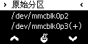

# 覆盖文件分区切换

采用 8MB 容量的 SPI Nor Flash 作为启动介质，未作任何改动和接入其它存储介质时，OpenWrt 系统可写空间大小为 1MB。1MB 大小的可写空间对于一般 IoT 应用已然绰绰有余，但是，当其作为其它用途时（比如开发平台、网络存储等），可写空间显然不足。这时，可采用对 Overlay 文件系统进行更改的做法，获得更大的可存储空间。

LBPanel 扩展命令页（左页） “系统功能” 子项中，提供 “覆盖文件分区切换”，无需繁琐的指令操作，直接选定作为根文件系统 (rootfs) 的覆盖文件分区 (overlay) 则可在重新启动后生效。甚至，可以用不同的覆盖分区分别安装相应软件及配置等，达到切换覆盖分区，即切换适合不同场景的专用系统的目的。

## 使用准备
使用该功能前，需要准备设备支持的存储介质（比如：TF 卡或者 U 盘等，以下仅以 U 盘为例）。

先用分区工具将 U 盘划分出空闲的 ext4 分区，在设备上使用 mkfs.ext4 指令对目标分区进行格式化。若需直接使用设备进行 U 盘分区，可用 opkg 安装 fdisk 后在 shell 中直接用指令操作。

此处，不建议在其它设备上对目标分区进行格式化，因为不同版本的 Linux 内核对 ext4 文件系统扩展属性 (feature) 相关不一定兼容，可能出现不能使用的现象；同理，该分区使用后不建议在其它设备进行可写访问。

U 盘分区建议：

    分区　类型　大小建议
    sda1    vfat　256MB
    sda2　ext4　按需求
    sda3　ext4　按需求

 
分区建议说明：

* sda1 可作为其它系统的 boot 分区，存储其所需设备树、Linux 核心、rootfs 映像等等。另外，可作为 USB OTG 虚拟存储设备指定目标，用 LBPanel 进行 "OTG 设备功能设置" 切换功能后，即可方便地与其它设备进行文件传输。

* sda2 可作为其它系统的 root 分区。

* sda3 则可作为所需的覆盖文件分区。

## 操作步骤

开机进入系统后，OLED 屏幕主页显示时（时间或者网卡信息等），双击 K1 键即可跳转至功能扩展页（左页），分别单击 K1、K3 键可切换子项，如下图所示切换至 “系统功能” 子项处。

单击 K2 键进入子菜单（如下图所示），分别单击 K1、K3 键可切换当前菜单子项，切换至 “覆盖文件分区切换” 处并单击 K2 键确定执行该功能。

检测信息后出现下图所示分区选择菜单。与上述操作类似，切换至目标分区后单击 K2 键即可进行 "分区切换"。

操作成功后，屏幕提示如下图所示，单击 K2 键重新启动设备使其生效。

